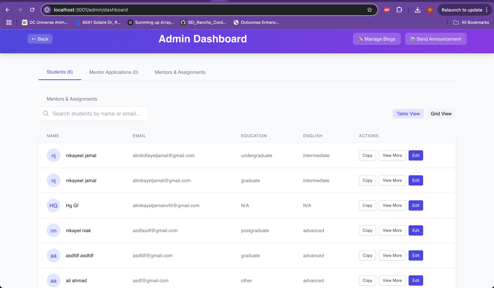
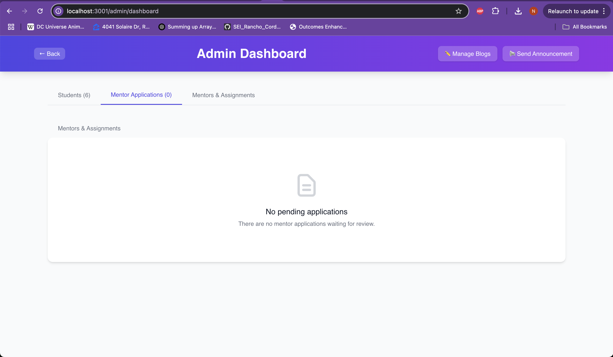
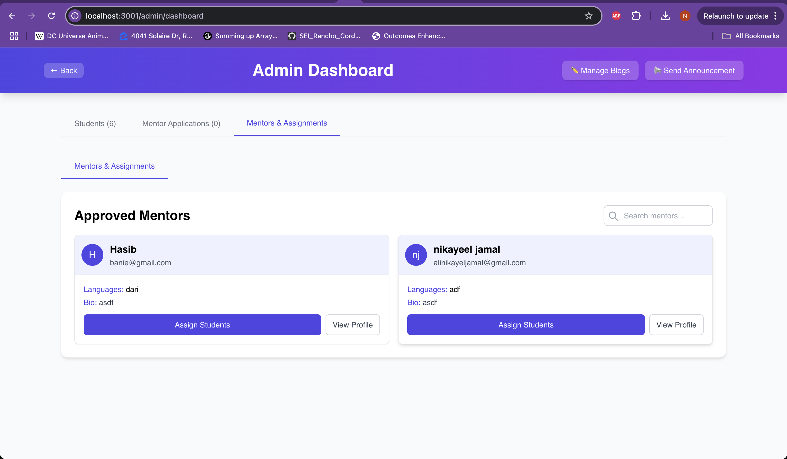

# 🌐 WatanHub

**Empowering Students with Mentorship, Community, and Resources**

WatanHub is a full-stack web application designed to connect students with mentors, provide educational resources, and clear communication through announcements and blog content.

---

## 🚀 Live Demo

🔗 https://watanhub.vercel.app

---

## ✨ Features

### 🧭 General

- Beautiful responsive landing page
- Smooth UI transitions
- Timeline-based About section

### 👤 Authentication

- Supabase login/signup
- Protected & admin-only routes
- -----> Next Sprint : Google Auth

### 👨‍🏫 Mentorship

- Mentor application & review system
- Admin assignment of students to mentors
- School choices management for students (target, safety, and stretch schools)
- Mentor visibility of student school preferences

### 🧠 Blog System

- Public blog viewing
- Admin-controlled CRUD for blogs

### 📢 Admin Dashboard

- View/manage blog analytics
- Send announcements

---

## 📸 Screenshots

#### 🔐 Admin Dashboard – Mentors & Assignments



#### 📄 Admin – No Pending Applications



#### 🧠 Manage Blogs


#### 📝 Create Blog Form



#### 🏠 Homepage


---

## 🧭 Application Flow

```text
1. Visitors land on homepage → see latest blogs and intro to the mission.
2. Users can:
   - Read blogs
   - View mentors and apply to be one
   - Reach out via contact
3. Admins can:
   - Approve mentors
   - Assign students
   - Create, update, and delete blogs
   - Send announcements
4. Authenticated users can access profile/dashboard.
```

---

## 🛠️ Tech Stack

| Frontend        | Backend           | Services          | Tooling      |
| --------------- | ----------------- | ----------------- | ------------ |
| React + JSX     | Node.js (Express) | Supabase          | dotenv, cors |
| React Router    | REST API          | Google Sheets API | Tailwind CSS |
| Sonner (toasts) |                   | Vercel Analytics  |              |

                                        Resend API(For contactForm)

---

## ⚙️ Setup & Development

### 1. Install Dependencies

```bash
cd client && npm install
cd ../server && npm install
```

### 2. Database Migrations

The `sql_commands.sql` file contains necessary database migrations for Supabase. Run these commands in your Supabase SQL editor to create:

- Student school preferences table
- Phone number field for user profiles
- Appropriate security policies

### 3. Run Locally

```bash
# Client
cd client
npm start

# Server
cd ../server
node server.js
```

---
